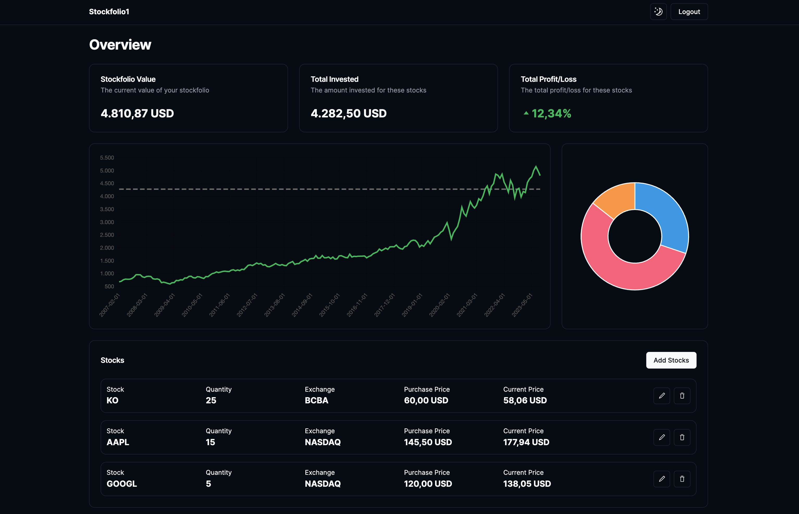
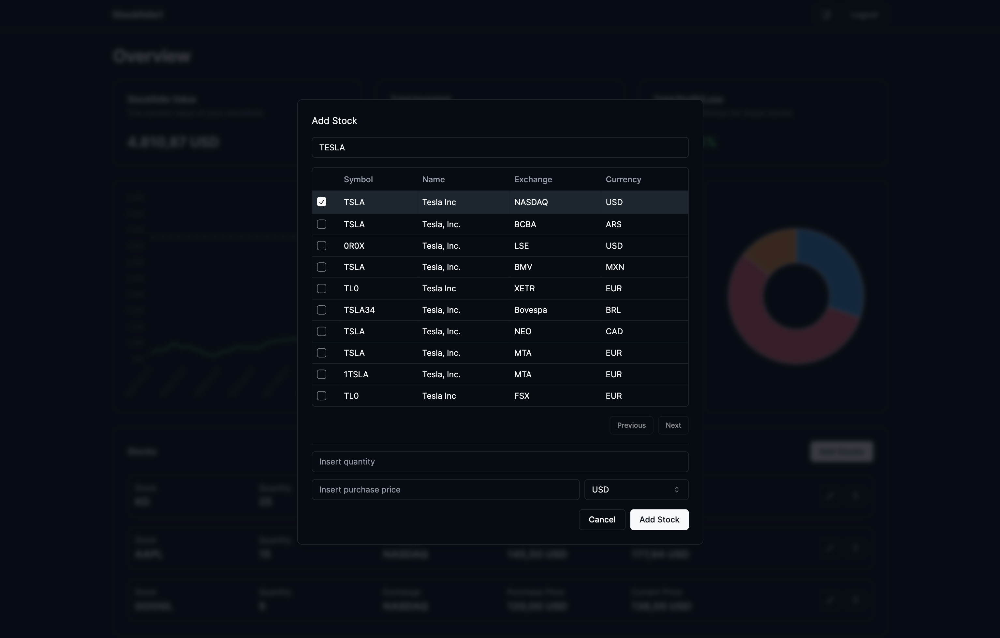
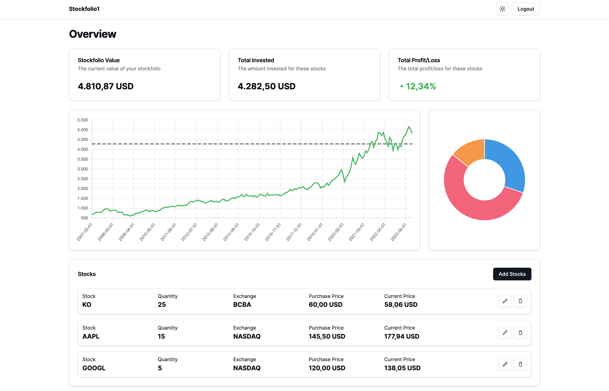

This is a [Next.js](https://nextjs.org/) project bootstrapped with [`create-next-app`](https://github.com/vercel/next.js/tree/canary/packages/create-next-app).

## 🎯 Setup


Create `.env.local` with this configuration:

```
NEXT_PUBLIC_SUPABASE_URL=
NEXT_PUBLIC_SUPABASE_ANON_KEY=
NEXT_RAPIDAPI_KEY=
NEXT_RAPIDAPI_HOST=
NEXT_ALPHAVANTAGE=
NEXT_TWELVEDATA=
NEXT_FREECURRENCYAPI
NEXT_FINNHUB=
```

```
nvm use
yarn
yarn dev
```